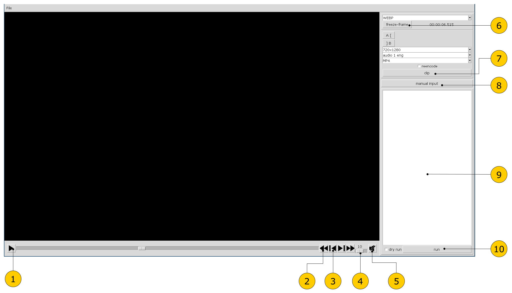

# videocutter

Application for taking clips or frames from a video file.

## Prerequisites

* Java 17 or newer
* Optional: system `ffmpeg` on `PATH` (or `FFMPEG` env) for fast stream-copy clips

## Build

```
./gradlew distZip
```

or

```
./gradlew distTar
```

## Install

Unpack `build/distributions/videocutter-2.0.0.zip` to the desired location.

Edit `conf/settings.properties`:

* `locale` — language of interface (`ru` or `en`)
* `numOfProcessors` — thread hint for decode/encode
* `initialDir` — file dialog start directory
* `defaultVolume` — default volume level (0–100)
* `muteOnStart` — if video preview should be muted by default (`true` or `false`)

Logging is configured via `conf/log4j2.xml`.

## Launch

```
videocutter/run /path/to/video.mkv
```

## How to use

* Launch application without arguments (or with a video file name as the argument).
* File → Open (Ctrl-O) to open a video.
* Navigating through the video, use tools on the right panel to create freeze-frame or clip jobs.
	* Use  and  buttons to go to key frames.
	* Use  and  buttons to refine frame search. The first press of one of these buttons sets the search interval from the current slider position to the nearest key frame; subsequent presses halve the interval. Eventually, the interval narrows to a single point or becomes so small that it's impossible to position the slider in its middle.
* Also you can manually import jobs from text lines (the same syntax as in the application log file).
* You can double-click a job to jump to the corresponding timestamp in video.
* To edit the job list, you can select and delete jobs pressing Delete.
* Press the "run" button to execute jobs. Images and clips will be created near the source file.
* At the end use menu File -> Quit (Ctrl-Q) to quit.


* 1 - play/pause
* 2 - go to next/previous key frame (also you can use Up and Down for it)
* 3 - binary frame search (also you can use Left and Right for it)
* 4 - volume control
* 5 - mute/unmute
* 6 - take a frame
* 7 - take a clip
* 8 - input jobs manually (the same syntax as in log file)
* 9 - jobs list
* 10 - execute jobs (check "dry run" to just preview commands)
